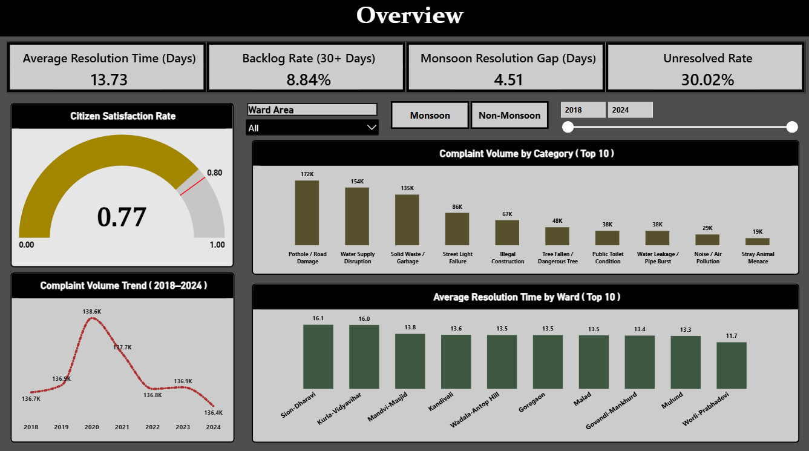
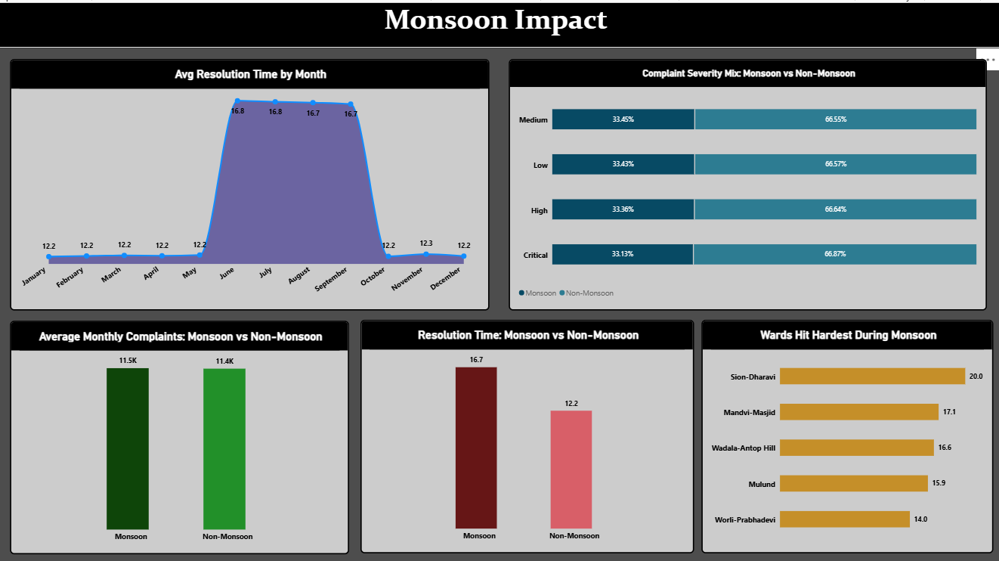
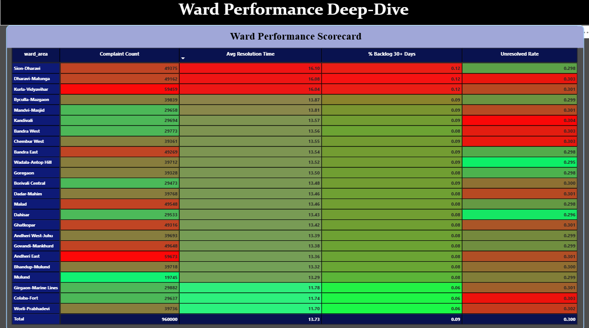
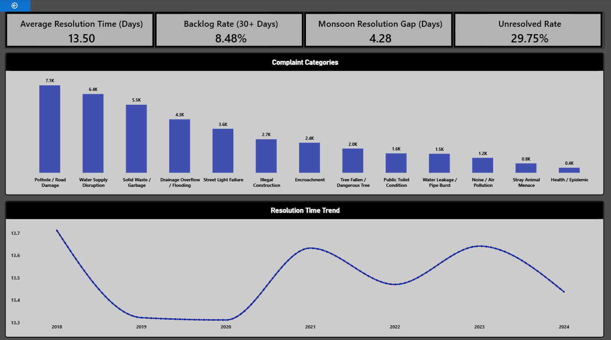
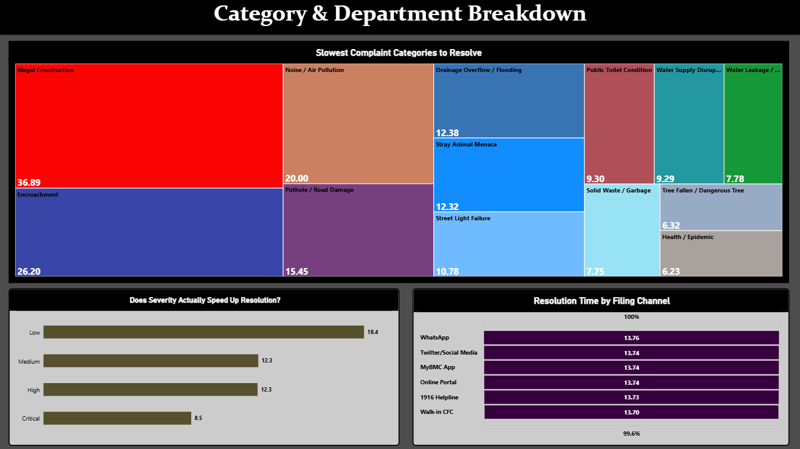

# Potholes & Priorities: Mumbai Civic Grievance Dashboard
Power BI dashboard analyzing Mumbai civic complaints (2018–2024)
## Key Findings
- During monsoon, complaint volume and severity mix stay the same, but resolution time rises 37% (12.2 to 16.7 days). This points to a capacity problem, not a demand problem.
- Inner-city wards (Sion-Dharavi, Dharavi-Matunga, Kurla-Vidyavihar) resolve complaints 3-4 days slower than the rest of the city.
- The unresolved rate is flat (~30%) across every ward, which suggests a systemic process issue rather than ward-specific failure.
- Critical complaints are resolved about 2x faster than low-severity ones, so severity-based prioritization works.
- Filing channel (app, helpline, WhatsApp, walk-in) has no effect on resolution speed.

## Tools Used
Python (pandas, Jupyter) · Power BI · DAX

## Data
Kaggle dataset "1.2M Complaints BMC - Predict Civic Satisfaction" (960,000 records, 24 wards, 2018-2024). It is a synthetic dataset modeled on BMC's grievance system, and it isn't included here because of file size. Findings were cross-checked against the Praja Foundation's 2025 Status of Civic Issues in Mumbai report.
## Dashboard Pages

### Citywide Summary

### Monsoon Impact

### Ward Performance Deep-Dive

### Ward Detail (Drill-through)

### Category & Department Breakdown

